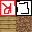

# Sand&Water Voxel Simulation
## Description
Project started with an idea of making a simple voxel engine and implementing "dynamic sand creatures".
With development, it turned out to be not-so-easy to do.
Projects main goal is to create efficient and good looking dynamic sand simulation in voxel world.

## Tools used
- `C++` with `CMake`,
- `raylib` (for rendering and game util),
- smaller libraries (i.e. for Perlin noise),
- `perf` and `gprof` for profiling

## Screens and recordings
### Showcase video 
[**CLICK HERE**](https://youtu.be/Bz357Av9Bb0) \
[**CLICK HERE**](https://youtu.be/Bz357Av9Bb0) \

### Images
 \

## Plans
- [x] Basic voxel world and chunk meshing
- [x] Small benchmarker to test efficiency of meshing
- [x] Texture and colored voxel faces rendering depending on block type
- [x] Inteface for editing the world through World class, not direct chunk access etc.
- [x] Fluid simulation
- [x] Sand simulation
- [ ] Basic physics and collisions
- [ ] Walking mechanics
- [ ] Sprites and NPC's